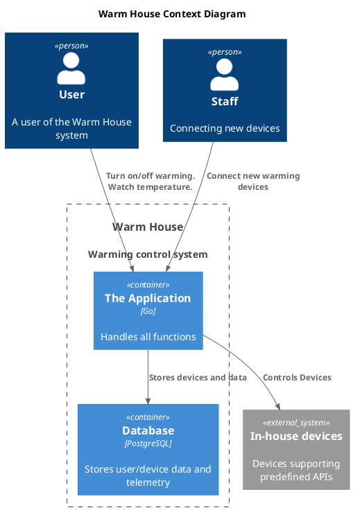
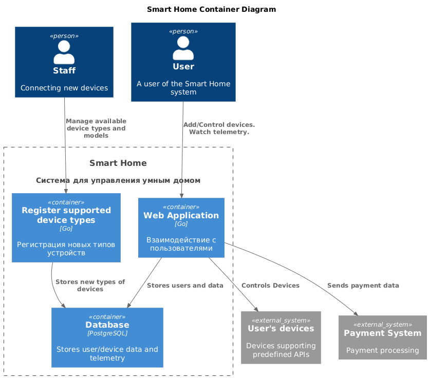
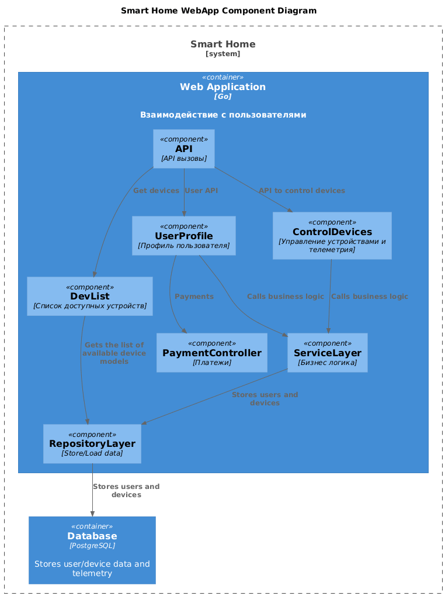
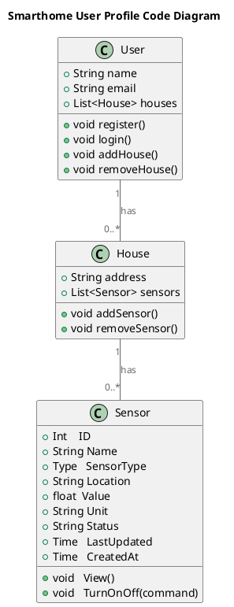
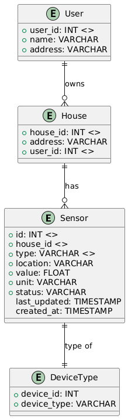

# Project_template

Это шаблон для решения проектной работы. Структура этого файла повторяет структуру заданий. Заполняйте его по мере работы над решением.

# Задание 1. Анализ и планирование

<aside>

Чтобы составить документ с описанием текущей архитектуры приложения, можно часть информации взять из описания компании и условия задания. Это нормально.

</aside

### 1. Описание функциональности монолитного приложения

**Управление отоплением:**

- Пользователи могут
   - удаленно включать/выключать отопление,
   
- Система поддерживает
   - отправку команд на включение/выключение отопления на устройства отопления 

**Мониторинг температуры:**

- Пользователи могут
   - просматривать данные о температуре через веб интерфейс
- Система поддерживает
   - получение данных о температуре с подключенных датчиков

### 2. Анализ архитектуры монолитного приложения

Перечислите здесь основные особенности текущего приложения: какой язык программирования используется, какая база данных, как организовано взаимодействие между компонентами и так далее.
1. Язык Go
2. База PostgreSQL
3. Архитектура монолитная, все компоненты системы (обработка запросов, бизнес-логика, работа с данными) находятся в рамках одного приложения.
4. Взаимодействие: Синхронное, запросы обрабатываются последовательно.
5. Масштабируемость: Ограничена, так как монолит сложно масштабировать по частям.
6. Развертывание: Требует остановки всего приложения.

### 3. Определение доменов и границы контекстов

Опишите здесь домены, которые вы выделили.
Бизнес область подразделяется на домены:

1. Домен: Управление устройствами

	- Поддомен: Отображение информации с устройств.

		* Контекст: Отображение показаний температуры.
		Сущности: датчик температуры
		Значения: значение температуры
		Агрегаты: показания температуры датчика (телеметрия)

	- Поддомен: Интерфейс управления устройствами
		* Контекст: Включение/выключение отопления (не реализован).
		сущности: команды управления, устройства
		сервис: Передача команд.

2. Домен. Подключение новых пользователей
	- Поддомен: Обработка платежей
	- Поддомен: управление пользователями

		* Контекст подключения:
			- Сущности: Устройства, пользователи
			- агрегаты: Подключение
			- репозитории: репозиторий подключений
			- сервисы: сервис регистрации подключений

### **4. Проблемы монолитного решения**

- Трудно масштабировать: подключение большого кол-ва устройств затруднено.
- Добавление новых ф-й (например, новых типов устройств) требует изменения всего приложения и полного перетестирования. Повышенный риск ошибок.
- Развертывание любого изменения требует перезапуска всего приложения.


### 5. Визуализация контекста системы — диаграмма С4




# Задание 2. Проектирование микросервисной архитектуры

В этом задании вам нужно предоставить только диаграммы в модели C4. Мы не просим вас отдельно описывать получившиеся микросервисы и то, как вы определили взаимодействия между компонентами To-Be системы. Если вы правильно подготовите диаграммы C4, они и так это покажут.

**Диаграмма контейнеров (Containers)**





**Диаграмма компонентов (Components)**

Добавьте диаграмму для каждого из выделенных микросервисов.




**Диаграмма кода (Code)**

Добавьте одну диаграмму или несколько.


# Задание 3. Разработка ER-диаграммы

.

# Задание 4. Создание и документирование API

### 1. Тип API

Для простоты реализации и перехода от монолита к микросервисам воспользуемся RestAPI (честно сказать, я других пока и не знаю).

### 2. Документация API

Здесь приложите ссылки на документацию API для микросервисов, которые вы спроектировали в первой части проектной работы. Для документирования используйте Swagger/OpenAPI или AsyncAPI.

Первый раз пользуюсь OpenAPI.


[Задокументированный API монолита](smart_home/monolith.yml)

[Задокументированые (не все) entry points ToBe решения](smart_home/API_v2.yml)


# Задание 5. Работа с docker и docker-compose

Перейдите в apps.

Там находится приложение-монолит для работы с датчиками температуры. В README.md описано как запустить решение.

Вам нужно:

1) сделать простое приложение temperature-api на любом удобном для вас языке программирования, которое при запросе /temperature?location= будет отдавать рандомное значение температуры.

Locations - название комнаты, sensorId - идентификатор названия комнаты

```
	// If no location is provided, use a default based on sensor ID
	if location == "" {
		switch sensorID {
		case "1":
			location = "Living Room"
		case "2":
			location = "Bedroom"
		case "3":
			location = "Kitchen"
		default:
			location = "Unknown"
		}
	}

	// If no sensor ID is provided, generate one based on location
	if sensorID == "" {
		switch location {
		case "Living Room":
			sensorID = "1"
		case "Bedroom":
			sensorID = "2"
		case "Kitchen":
			sensorID = "3"
		default:
			sensorID = "0"
		}
	}
```

Приложение на python: apps/smart_home/apis/temperature-api

2) Приложение следует упаковать в Docker и добавить в docker-compose. Порт по умолчанию должен быть 8081

См. apps/smart_home/apis/Dockerfile.
apps/docker-compose.yml изменен, чтобы включить temperature-api.

3) Кроме того для smart_home приложения требуется база данных - добавьте в docker-compose файл настройки для запуска postgres с указанием скрипта инициализации ./smart_home/init.sql

- Добавлено.

Для проверки можно использовать Postman коллекцию smarthome-api.postman_collection.json и вызвать:

- Create Sensor
- Get All Sensors

Должно при каждом вызове отображаться разное значение температуры

Ревьюер будет проверять точно так же.


# **Задание 6. Разработка MVP**

Необходимо создать новые микросервисы и обеспечить их интеграции с существующим монолитом для плавного перехода к микросервисной архитектуре. 

### **Что нужно сделать**

1. Создайте новые микросервисы для управления телеметрией и устройствами (с простейшей логикой), которые будут интегрированы с существующим монолитным приложением. Каждый микросервис на своем ООП языке.

light_control - как пример управления светом. На Go.
userprofile - микросервис на python для поддержки профилей пользователей.

2. Обеспечьте взаимодействие между микросервисами и монолитом (при желании с помощью брокера сообщений), чтобы постепенно перенести функциональность из монолита в микросервисы. 

light_control переадресует ряд запросов на монолит. Например, проверяет sensorid на наличие в базе и проверяет тип сенсора/устрйства (light).

userprofile - заглушка, создающая список пользователей в памяти, посколько структура базы нужна новая.


В результате у вас должны быть созданы Dockerfiles и docker-compose для запуска микросервисов.

Оба новых сервиса имеют свои Dockerfiles и объединены в новом docker-compose_v2.yml. Таким образом можно держать запущенным монолит (с базой и симулятором температурного датчика) и разрабатывать и тестировать новые сервисы, взаимодействующие с монолитом, запуская их из независимого docker compose файла.